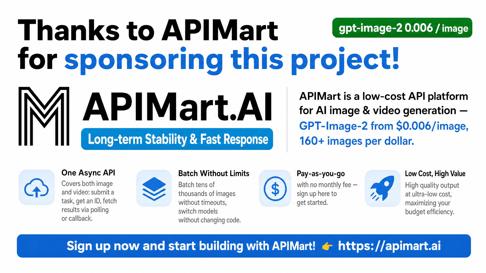

<div align="center">


# CLI Proxy API Management Center

**Your proxy, at a glance. Your configuration, in control.**

A lightweight Web UI for CLI Proxy API.<br>
Manage providers, credentials, quotas, and logs — from a single HTML file.

[](https://github.com/router-for-me/CLIProxyAPI)
[](#deployment)
[](LICENSE)

**English** · [简体中文](README_CN.md)

[Get started](#quick-start) · [Features](#features) · [Development](#development) · [Releases](https://github.com/router-for-me/Cli-Proxy-API-Management-Center/releases)

</div>

---

## One place to manage your instance

From everyday configuration to troubleshooting, keep the essentials close at hand.

| Configure | Connect | Observe |
| --- | --- | --- |
| Edit settings visually or in YAML, with a diff before saving. | Manage provider keys, auth files, and OAuth flows. | Check instance status, provider quotas, and request logs. |

**Single-file deployment** · **Responsive layout** · **Four UI languages**

> [!IMPORTANT]
> Requires **CLI Proxy API ≥ 8.0.0**; the latest v8 release is recommended. This repository is the management UI, not the proxy — it does not forward traffic. It uses the **v8 Management API** (`/v8/management`) and v8 configuration layout, with no v0 fallback. Plugin resources and custom extensions retain their backend-declared paths.

## Quick start

The UI is bundled with [CLI Proxy API](https://github.com/router-for-me/CLIProxyAPI). No separate frontend deployment is needed for the standard setup.

1. Start your CLI Proxy API service.
2. Open `http://<host>:<api_port>/management.html`.
3. Enter your **management key** and connect.

The API address is detected from the page URL and can be changed manually.

> [!NOTE]
> The **management key** signs you into this UI. Client keys in `access.api-keys` authorize requests to the proxy — they are not interchangeable.

<details>
<summary><strong>Connection settings & remote access</strong></summary>

The UI accepts addresses such as `localhost:8317`, `https://example.com:8317`, or `http://example.com:8317/v8/management`; the management suffix is removed automatically.

Management requests use `Authorization: Bearer <MANAGEMENT_KEY>`. Remote access may require `management.allow-remote: true` on the server. See the [backend documentation](https://github.com/router-for-me/CLIProxyAPI) for authentication rules and server-side limits.

</details>

<details>
<summary><strong>Upgrading from v7</strong></summary>

Upgrade the backend first and back up `config.yaml`. The backend returns the v8 configuration layout on reads; a successful v8 configuration write migrates the stored file. The editor only writes v8 fields:

- `access.api-keys`: client keys for accessing the proxy.
- Top-level `api-keys`: upstream provider groups.

</details>

## Features

| Area | What you can do |
| --- | --- |
| **Dashboard** | See connection status, server version, build date, and model availability at a glance. |
| **Configuration** | Edit common settings and client keys visually, or use the YAML editor with search, highlighting, and a save diff preview. |
| **AI providers** | Configure Gemini, Codex, Claude, Vertex, and OpenAI-compatible providers; manage keys, headers, proxies, and model mappings. |
| **Auth files & OAuth** | Upload, download, and organize credentials; connect supported providers with OAuth or device flows; manage model aliases and exclusions. |
| **Quotas** | Inspect quota and usage information for supported providers, including Claude, Antigravity, Codex, Kimi, and xAI/Grok. |
| **Logs** | Follow logs with auto-refresh, search, hide management traffic, and download request error logs. |
| **Plugins** | Access plugin management when the connected backend advertises support. |
| **System** | Check for updates, inspect available models, and clear local login data. |

Supports **English, 简体中文, 繁體中文, and Русский**, with browser-language detection and a manual language switch. Responsive layouts support desktop, tablet, and mobile use in modern Chrome, Firefox, Safari, and Edge.

## Sponsor

[](https://go.apimart.ai/gh-cli-proxy-api-management-center)

Thanks to **APIMart** for sponsoring this project!

APIMart is a low-cost API platform for AI image & video generation — GPT-Image-2 from $0.006/image, 160+ images per dollar. One async API covers both image and video: submit a task, get an ID, fetch results via polling or callback. Batch tens of thousands of images without timeouts, switch models without changing code. Pay-as-you-go with no monthly fee — [sign up here](https://go.apimart.ai/gh-cli-proxy-api-management-center) to get started.

## Deployment

To build your own single-file UI, use **Bun 1.3.14**:

```bash
bun install --frozen-lockfile
bun run build
```

The output is **`dist/index.html`**, with JavaScript, CSS, and bundled assets inlined. The release workflow renames it to `management.html` for backend hosting.

Use `bun run preview` to preview locally. Prefer an HTTP server over opening the file via `file://`, which can encounter browser CORS restrictions.

<details>
<summary><strong>Release details</strong></summary>

- Tags matching `vX.Y.Z` trigger [the release workflow](.github/workflows/release.yml).
- The UI version is injected at build time from `VERSION`, then git tags, then the package version, with `dev` as the final fallback.
- Hash routing and an ES2020 build target keep deployment simple.

</details>

## Development

```bash
bun install --frozen-lockfile
bun run dev
```

Open `http://localhost:5173` and connect to your backend instance.

**Built with** React 19 · TypeScript 6 · Vite 8 · Zustand · Axios · React Router 7 · Motion · CodeMirror 6 · SCSS Modules · i18next.

| Command | Purpose |
| --- | --- |
| `bun run dev` | Start the Vite dev server |
| `bun run build` | TypeScript compilation + production build |
| `bun run preview` | Serve the build locally |
| `bun run test` | Run Bun tests |
| `bun run lint` | Run ESLint; warnings are not treated as failures |
| `bun run type-check` | Run `tsc --noEmit` |
| `bun run verify` | Run tests, lint, and build |
| `bun run format` | Format source files with Prettier |

Issues and PRs are welcome. Include reproduction steps, backend and UI versions, screenshots for UI changes, and verification results. See [AGENTS.md](AGENTS.md) for repository conventions.

## Security

Treat the management key as a secret. When **remember password** is enabled, it is persisted in browser storage using reversible obfuscation — **not encryption**.

Use a trusted device or dedicated browser profile. Enable remote management only after evaluating the exposure of your server.

## Troubleshooting

<details>
<summary><strong>Connection or authentication problems</strong></summary>

- **Cannot connect / 401:** check the API address and management key. Remote connections may require remote management to be enabled.
- **Repeated authentication failures:** the server may temporarily block remote IPs.

</details>

<details>
<summary><strong>Missing pages, unsupported features, or failed tests</strong></summary>

- **Logs page missing:** enable “Logging to file” in Basic Settings.
- **Feature unsupported:** check the backend version and whether the relevant endpoint is enabled. Some capabilities depend on backend support.
- **Model list unavailable:** querying `/v1/models` requires at least one proxy API key.
- **OpenAI provider test fails:** this test runs in the browser and depends on the provider's network reachability and CORS policy. Failure does not necessarily mean the backend cannot reach it.

</details>

---

<div align="center">

[CLI Proxy API](https://github.com/router-for-me/CLIProxyAPI) · [Report an issue](https://github.com/router-for-me/Cli-Proxy-API-Management-Center/issues) · [MIT License](LICENSE)

</div>
