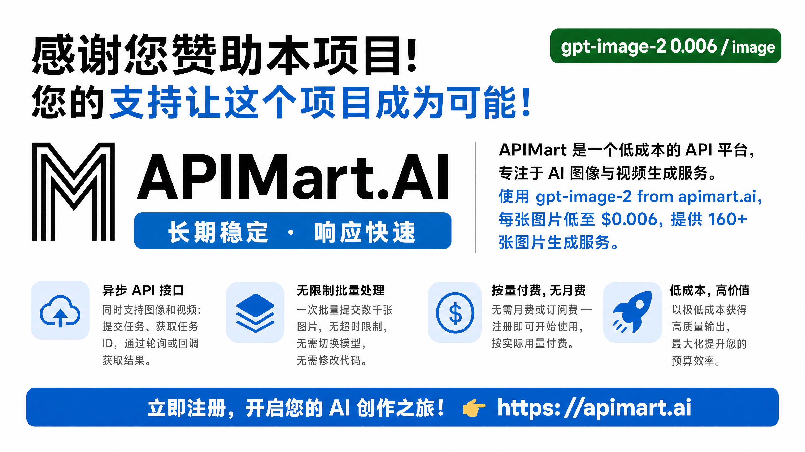

<div align="center">


# CLI Proxy API 管理中心

**运行状态，一目了然。服务配置，尽在掌握。**

为 CLI Proxy API 打造的轻量 Web 管理界面。<br>
提供商、凭据、配额与日志，一个 HTML 文件即可管理。

[](https://github.com/router-for-me/CLIProxyAPI)
[](#部署)
[](LICENSE)

[English](README.md) · **简体中文**

[快速开始](#快速开始) · [功能一览](#功能一览) · [本地开发](#本地开发) · [下载发布版本](https://github.com/router-for-me/Cli-Proxy-API-Management-Center/releases)

</div>

---

## 一个界面，掌握服务全貌

从日常配置到故障排查，让常用操作触手可及。

| 配置服务 | 接入模型 | 观察运行 |
| --- | --- | --- |
| 可视化或 YAML 编辑，保存前查看差异。 | 统一管理提供商密钥、认证文件与 OAuth 授权。 | 查看服务状态、提供商配额与请求日志。 |

**单文件部署** · **响应式布局** · **四种界面语言**

> [!IMPORTANT]
> 需要 **CLI Proxy API ≥ 8.0.0**，推荐使用最新 v8 版本。本仓库仅包含管理界面，**不是代理本体，不参与流量转发**。仅使用 **v8 Management API**（`/v8/management`）与 v8 配置结构，不提供 v0 回退；插件资源与自定义扩展保留后端声明的路径。

## 快速开始

[CLI Proxy API](https://github.com/router-for-me/CLIProxyAPI) 已内置 Web UI，常规使用无需单独部署前端。

1. 启动 CLI Proxy API 服务。
2. 打开 `http://<host>:<api_port>/management.html`。
3. 输入 **管理密钥** 并连接。

页面会根据当前 URL 自动识别 API 地址，也支持手动修改。

> [!NOTE]
> **管理密钥**用于登录本界面；`access.api-keys` 中的客户端密钥用于请求代理接口，两者不能混用。

<details>
<summary><strong>连接设置与远程访问</strong></summary>

支持 `localhost:8317`、`https://example.com:8317` 或 `http://example.com:8317/v8/management` 等地址格式；管理接口后缀会被自动移除。

管理请求使用 `Authorization: Bearer <MANAGEMENT_KEY>`。远程访问可能需要在服务端开启 `management.allow-remote: true`。完整鉴权规则与服务端限制请参考[后端文档](https://github.com/router-for-me/CLIProxyAPI)。

</details>

<details>
<summary><strong>从 v7 升级</strong></summary>

请先升级后端并备份 `config.yaml`。后端读取时返回 v8 配置结构，成功的 v8 配置写入会迁移磁盘文件。编辑器仅写入 v8 字段：

- `access.api-keys`：访问代理的客户端密钥。
- 顶层 `api-keys`：上游提供商分组。

</details>

## 功能一览

| 模块 | 你可以做什么 |
| --- | --- |
| **仪表盘** | 快速查看连接状态、服务版本、构建时间与可用模型概览。 |
| **配置面板** | 可视化编辑常用设置与客户端密钥；也可使用支持搜索、高亮和保存前差异预览的 YAML 编辑器。 |
| **AI 提供商** | 配置 Gemini、Codex、Claude、Vertex 与 OpenAI 兼容提供商，管理密钥、请求头、代理和模型映射。 |
| **认证文件与 OAuth** | 上传、下载和整理凭据，通过 OAuth 或设备码流程连接支持的提供商，管理模型别名与排除规则。 |
| **配额** | 查看支持的提供商的配额与使用情况，包括 Claude、Antigravity、Codex、Kimi 和 xAI/Grok 等。 |
| **日志** | 自动刷新、搜索日志、隐藏管理端流量，以及下载请求错误日志。 |
| **插件** | 在已声明支持插件的后端上使用插件管理功能。 |
| **系统信息** | 检查更新、查看可用模型，以及清理本地登录数据。 |

支持 **English、简体中文、繁體中文和 Русский**，自动识别浏览器语言，也可手动切换。响应式布局适配桌面、平板与手机，支持现代 Chrome、Firefox、Safari 和 Edge 浏览器。

## 赞助商

[](https://go.apimart.ai/gh-cli-proxy-api-management-center)

感谢 **APIMart** 赞助本项目！

APIMart 是专注 AI 图片/视频生成的低价 API 平台，GPT-Image-2 低至 $0.006/张，1 美元可出图 160+ 张。图片、视频一套异步 API 通吃，提交任务拿 ID、回调取结果，跑批万张不超时、换模型不改代码。按量付费、无月费，通过[此注册链接](https://go.apimart.ai/gh-cli-proxy-api-management-center)注册即可开用。

## 部署

如需自行构建单文件界面，使用 **Bun 1.3.14**：

```bash
bun install --frozen-lockfile
bun run build
```

产物为 **`dist/index.html`**，JavaScript、CSS 与打包资源均已内联。发布工作流会将其重命名为 `management.html`，供后端托管。

使用 `bun run preview` 本地预览。建议通过 HTTP 服务访问，直接用 `file://` 打开可能受到浏览器 CORS 限制。

<details>
<summary><strong>发布细节</strong></summary>

- `vX.Y.Z` 格式的标签会触发[发布工作流](.github/workflows/release.yml)。
- UI 版本在构建时注入，依次取自 `VERSION`、git tag、package 版本，最终回退为 `dev`。
- 使用 Hash 路由与 ES2020 构建目标，保持部署简单。

</details>

## 本地开发

```bash
bun install --frozen-lockfile
bun run dev
```

打开 `http://localhost:5173`，连接你的后端实例。

**技术栈**：React 19 · TypeScript 6 · Vite 8 · Zustand · Axios · React Router 7 · Motion · CodeMirror 6 · SCSS Modules · i18next。

| 命令 | 用途 |
| --- | --- |
| `bun run dev` | 启动 Vite 开发服务器 |
| `bun run build` | TypeScript 编译与生产构建 |
| `bun run preview` | 本地预览构建产物 |
| `bun run test` | 运行 Bun 测试 |
| `bun run lint` | 运行 ESLint，警告不视为失败 |
| `bun run type-check` | 运行 `tsc --noEmit` |
| `bun run verify` | 运行测试、lint 与构建 |
| `bun run format` | 使用 Prettier 格式化源文件 |

欢迎提交 Issue 与 PR。请附上复现步骤、后端与 UI 版本、界面改动截图和验证结果。仓库约定见 [AGENTS.md](AGENTS.md)。

## 安全提示

请妥善保管管理密钥。启用 **记住密码** 后，密钥会以可逆混淆形式保存在浏览器存储中，**这不是加密**。

建议使用可信设备或独立浏览器配置。开启远程管理前，请评估服务的暴露范围。

## 常见问题

<details>
<summary><strong>连接或鉴权失败</strong></summary>

- **无法连接 / 401**：检查 API 地址与管理密钥；远程连接可能需要服务端开启远程管理。
- **反复鉴权失败**：服务端可能临时封禁远程 IP。

</details>

<details>
<summary><strong>页面缺失、功能不支持或测试失败</strong></summary>

- **日志页面不显示**：请在基础设置中开启“写入日志文件”。
- **功能提示不支持**：检查后端版本与相关接口是否启用，部分能力依赖后端支持。
- **无法获取模型列表**：查询 `/v1/models` 至少需要一个代理 API Key。
- **OpenAI 提供商测试失败**：测试在浏览器侧执行，受提供商网络可达性与 CORS 策略影响；失败不一定代表后端无法连接。

</details>

---

<div align="center">

[CLI Proxy API](https://github.com/router-for-me/CLIProxyAPI) · [反馈问题](https://github.com/router-for-me/Cli-Proxy-API-Management-Center/issues) · [MIT 许可证](LICENSE)

</div>
